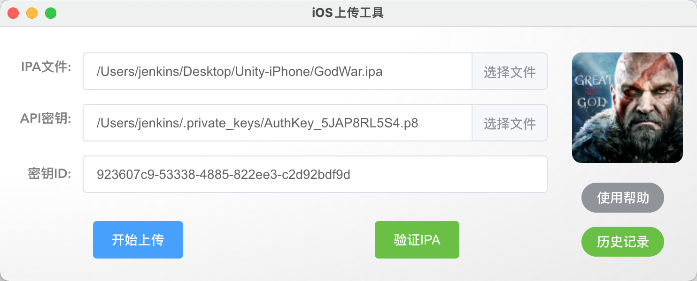
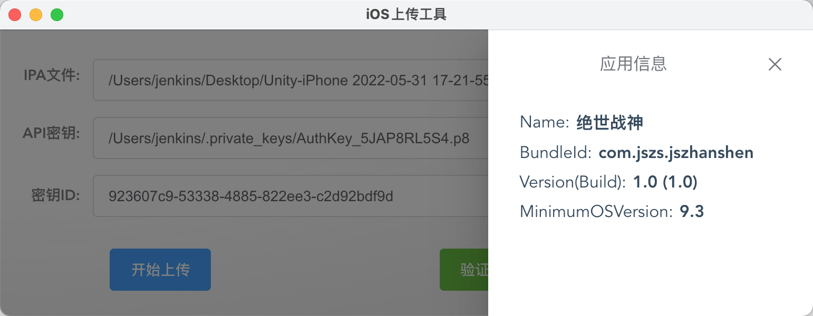
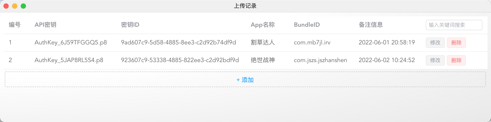

# IPAUploader
### iOS ipa上传工具

#### 基于 Electron13.0+vue3.0+element-plus2.0+vue-router4.0


### 使用

#### 1、安装依赖库

```sh
cd appuploader  #package.json目录
npm install
```

#### 2、启动测试server

```sh
npm run electron:serves
```

#### 3、打包应用

```
npm run electron:build
```

已打包应用

`./appuploader/MacApp/ipa上传-1.0.0.dmg`


### 应用截图

1、上传主页



2、应用信息-点击icon查看



3、历史记录-上传/验证时自动保存也可以手动添加修改删除




### 其它相关

###### 1、npm升级package.json依赖包到最新版本号

http://nodejs.cn/learn/update-all-the-nodejs-dependencies-to-their-latest-version

```sh
$ npm install -g npm-check-updates

进入package.json所在目录，检查package.json中dependencies的最新版本：
$ ncu or  npm-check-updates

更新dependencies到新版本，检查package.json文件，会发现package.json里面的依赖版本号已经变成最新版本
$ ncu -u

更新全部到最新版本
$ npm install
```


2、疑难杂症解决

```sh
$ rm -rf node_modules
$ rm -f package-lock.json
$ npm cache clear --force
$ npm install
$ npm run electron:serve
```


## Mac 上安装python3

上传工具依赖Python3环境开发，已安装请忽略

安装教程：https://pythonguidecn.readthedocs.io/zh/latest/starting/install3/osx.html

```sh
查看当前Python版本
$ python --version
查看Python路径
$ which python
查看全部Python路径
$ echo $PATH
查看Python3路径
$ which python3

查看pip2版本
$ pip2 --version
查看pip3版本
$ pip3 --version

查看python版本
$ python --version
Python 3.5.1
查看Python3版本
$ python3 --version
```

